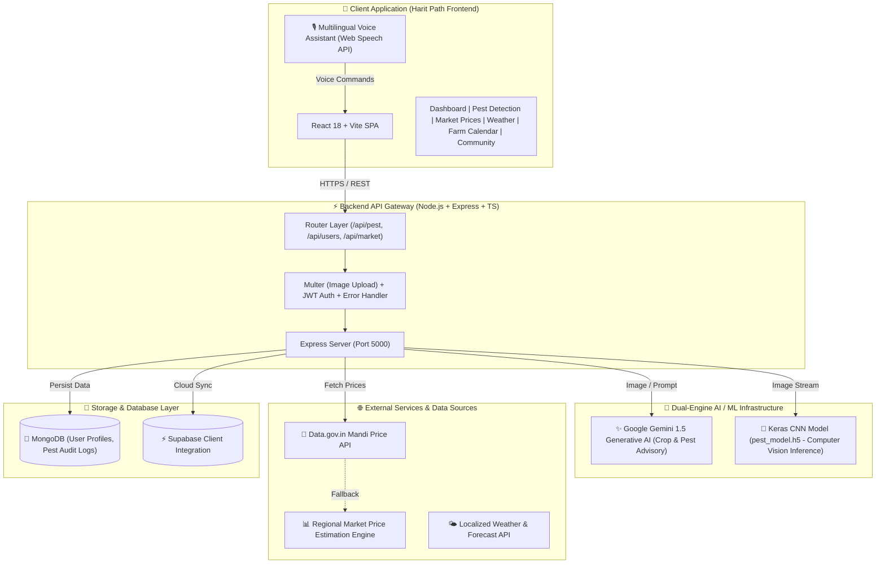

# 🌾 Harit Kranti (Harit Path) - AI-Powered Smart Agriculture & Farmer Empowerment Platform

[](LICENSE)
[](https://react.dev/)
[](https://nodejs.org/)
[](https://ai.google.dev/)
[](https://www.mongodb.com/)
[](#)

---

## 📌 Executive Summary & Vision

**Harit Kranti** (also known as **Harit Path** / **Smart Kheti**) is a next-generation, AI-driven agricultural ecosystem designed to empower farmers with real-time actionable insights, automated crop disease diagnostics, localized market commodity prices (Mandi rates), hyperlocal weather advisory, and multilingual voice assistance.

By bridging modern machine learning (Computer Vision & Generative AI) with intuitive regional language interfaces, Harit Kranti equips smallholder and commercial farmers with data-driven decision-making tools to improve crop yields, mitigate pest threats, and optimize market timing.

---

## 🏗️ System Architecture & Data Flow

Harit Kranti is architected as a modular, decoupled full-stack platform comprising a modern React single-page application (SPA), an Express API Gateway, a dual-engine AI intelligence service, and real-time external data pipelines.

### 📐 High-Level Architecture Diagram



---

## ✨ Core Features & Technical Capabilities

### 1. 🔬 AI Computer Vision & Generative Pest Diagnostics
* **Dual Diagnostic Engine**: Combines deep learning Keras CNN model (`pest_model.h5`) for instantaneous pattern matching with **Google Gemini AI** for natural language treatment plans.
* **Instant Remedy Generation**: Provides step-by-step biological and chemical treatment recommendations, spray dosages, and preventative measures.
* **Audit History**: Saves diagnostic results and imagery to MongoDB for historical crop health tracking.

### 2. 🌾 Smart Crop Advisory & Seasonal Management
* Dynamic crop recommendations tailored to soil type, geographic region, and seasonal weather patterns.
* Best practices for fertilizer application, irrigation intervals, and soil nutrition management.

### 3. 📊 Real-Time Mandi & Market Commodity Tracker
* **Direct Mandi Rates Integration**: Connects to `data.gov.in` agricultural market data feeds.
* **Smart Fallback Engine**: Algorithmic regional price calculation for tracked crops (*Wheat, Rice, Maize, Soybean, Sugarcane*) across Indian states.
* Enables farmers to compare prices across nearby markets to maximize revenue.

### 4. 🌤️ Localized Weather & Agricultural Forecasts
* Real-time temperature, humidity, precipitation probability, and wind speed.
* Agricultural action alerts based on extreme weather events (heavy rain warnings, heatwaves, frost prevention).

### 5. 🎙️ Multilingual Voice Assistant & Control
* Hands-free voice interface supporting regional Indian languages (Hindi, English, etc.).
* Integrated speech recognition and text-to-speech synthesis (Web Speech API) allowing farmers to query market rates, weather, and crop advice verbally.

### 6. 📅 Interactive Farm Calendar & Scheduler
* Personalized farming activity calendar covering land preparation, sowing, fertilizing, weeding, and harvesting.
* Automated reminders for critical farming milestones.

### 7. 👥 Farmer Community Knowledge Hub
* Peer-to-peer discussion forum allowing farmers to ask questions, share field experience, post photos of crops, and seek guidance from fellow farmers and agronomists.

### 8. 🔐 Secure Authentication & Profile Setup
* User registration and authentication powered by **JWT (JSON Web Tokens)** and **Bcrypt** password hashing.
* Profile customization storing land acreage, primary crops grown, and location preferences.

---

## 📂 Repository Directory Structure

```text
Harit-Kranti/
├── README.md                          # Comprehensive Project Documentation
├── backend/                           # Node.js + Express + TypeScript Backend
│   ├── package.json                   # Backend dependencies & npm scripts
│   ├── tsconfig.json                  # TypeScript configuration
│   ├── src/
│   │   ├── app.ts                     # Express application configuration & middleware setup
│   │   ├── server.ts                  # Database connection & server entry point
│   │   ├── config/
│   │   │   └── db.ts                  # MongoDB Mongoose connection handler
│   │   ├── controllers/
│   │   │   ├── pestController.ts      # Handles pest detection requests & history retrieval
│   │   │   └── userController.ts      # Authentication (register/login) logic
│   │   ├── middleware/
│   │   │   └── errorHandler.ts        # Global error handling middleware
│   │   ├── models/
│   │   │   ├── User.ts                # Mongoose User Schema
│   │   │   ├── pestResult.ts          # Mongoose Pest Diagnostic Result Schema
│   │   │   └── pest_model.h5          # Trained TensorFlow/Keras CNN model file
│   │   ├── routes/
│   │   │   ├── marketRoutes.ts        # Mandi price API endpoints (/api/market)
│   │   │   ├── pestRoutes.ts          # Diagnostic endpoints (/api/pest)
│   │   │   └── userRoutes.ts          # Auth endpoints (/api/users)
│   │   ├── services/
│   │   │   ├── geminiService.ts       # Google Gemini AI API Client integration
│   │   │   ├── mlModel.js             # Python/Keras model inference loader
│   │   │   ├── marketPricesService.ts # Mandi API & regional fallback pricing service
│   │   │   ├── pestService.ts         # Diagnostic service bridge
│   │   │   └── supabaseClient.js      # Supabase client initializer
│   │   └── utils/
│   │       └── upload.ts              # Multer storage configuration for uploaded images
│   └── uploads/                       # Temporary storage directory for uploaded plant images
│
└── frontend/                   # React + TypeScript + Vite Frontend App
    ├── package.json                   # Frontend dependencies & Vite scripts
    ├── vite.config.ts                 # Vite build configuration
    ├── index.html                     # HTML5 Root Entry
    └── src/
        ├── App.tsx                    # Main React Router & Application Container
        ├── main.tsx                   # React DOM render entry point
        ├── index.css                  # Global Tailwind CSS styles & tokens
        ├── assets/                    # Static UI images, weather icons & crop heroes
        ├── components/
        │   ├── Dashboard.tsx          # Interactive Farmer Dashboard UI
        │   ├── PestDetection.tsx      # Image upload, camera capture & diagnostic view
        │   ├── MarketPrices.tsx       # Mandi commodity price tracker component
        │   ├── WeatherDetails.tsx     # Weather widget & localized forecast
        │   ├── FarmCalendar.tsx       # Seasonal farm task management calendar
        │   ├── ChatAssistant.tsx      # AI Chatbot interface (Gemini-powered)
        │   ├── VoiceAssistant.tsx     # Multilingual voice control overlay
        │   ├── VoiceButton.tsx        # Floating mic button UI component
        │   ├── VoiceLanguageContext.tsx # Global voice language state provider
        │   ├── Community.tsx          # Farmer forum & Q&A feed
        │   ├── OnboardingScreen.tsx   # Initial user setup & welcome flow
        │   ├── AuthModal.tsx          # Login & Signup Modal component
        │   └── ui/                    # Shadcn UI Design System components (Button, Card, Dialog, Tabs...)
        ├── hooks/
        │   ├── useSpeech.ts           # Custom React hook for Web Speech API
        │   └── use-toast.ts           # Toast notifications hook
        └── types/
            └── screens.ts             # Navigation screen type definitions
```

---

## 🛠️ Technology Stack & Libraries

| Category | Technology | Usage / Description |
| :--- | :--- | :--- |
| **Frontend Framework** | **React 18** | UI component architecture |
| **Build System** | **Vite** | Lightning-fast development & production bundle tool |
| **Language** | **TypeScript** | Type-safe development across frontend & backend |
| **Styling** | **Tailwind CSS** | Utility-first responsive CSS framework |
| **Component Library** | **Shadcn UI / Radix UI** | Accessible, custom-designed UI primitives |
| **Animations** | **Framer Motion + React Parallax Tilt** | Micro-animations and 3D card tilt effects |
| **State & Data Fetching**| **TanStack React Query v5** | Server state management & caching |
| **Voice Interface** | **Web Speech API** | Browser-native Speech Recognition & Synthesis |
| **Backend Runtime** | **Node.js** | Event-driven backend environment |
| **Server Framework** | **Express.js** | REST API Routing & HTTP middleware |
| **Generative AI** | **Google Gemini 1.5 API** | Generative AI advisory and agronomy chatbot |
| **Computer Vision** | **Keras / TensorFlow (`.h5`)** | Image-based pest classification |
| **Database** | **MongoDB (Mongoose)** | User accounts & diagnostic audit storage |
| **Cloud Storage** | **Supabase** | File storage & auxiliary relational cloud database |
| **File Uploads** | **Multer** | Multipart form data processing |

---

## 📡 API Reference & Endpoints

### 🦠 Pest Diagnostic Routes (`/api/pest`)
| Method | Endpoint | Description | Request Payload | Response |
| :--- | :--- | :--- | :--- | :--- |
| `POST` | `/api/pest/detect` | Upload image / text description for AI analysis | Multipart (`image` file or `pestDescription` string) | `{ success: true, result: { description, advice, createdAt } }` |
| `GET` | `/api/pest/history` | Retrieve historical pest diagnostic records | None | `{ success: true, history: [...] }` |

### 🌾 Market & Mandi Routes (`/api/market`)
| Method | Endpoint | Description | Query Parameters | Response |
| :--- | :--- | :--- | :--- | :--- |
| `GET` | `/api/market/prices` | Fetch real-time commodity prices by state | `state` (e.g. `state=Uttar Pradesh`) | `{ state, source, asOf, crops: [{ crop, avgPrice, minPrice, maxPrice }] }` |

### 🔐 User & Auth Routes (`/api/users`)
| Method | Endpoint | Description | Request Body | Response |
| :--- | :--- | :--- | :--- | :--- |
| `POST` | `/api/users/register` | Create new farmer account | `{ name, email, password }` | `{ message: "User registered successfully" }` |
| `POST` | `/api/users/login` | Authenticate user & receive JWT | `{ email, password }` | `{ token, user }` |

---

## ⚙️ Environment Variables Configuration

Create a `.env` file in the `backend/` directory with the following variables:

```env
# Backend Server Configuration
PORT=5000

# Database Connections
MONGO_URI=mongodb://localhost:27017/haritpath

# Security & Authentication
JWT_SECRET=your_super_secret_jwt_key_here

# AI Engine Keys
GEMINI_API_KEY=your_google_gemini_api_key_here

# Optional Data Feeds
DATA_GOV_IN_API_KEY=your_data_gov_in_api_key_here
```

For the frontend (`frontend/`), create a `.env` or `.env.local` file:

```env
VITE_API_BASE_URL=http://localhost:5000/api
VITE_GEMINI_API_KEY=your_google_gemini_api_key_here
```

---

## 🚀 Quickstart & Installation Guide

### Prerequisites
* **Node.js**: v18.0.0 or higher
* **npm** or **bun**
* **MongoDB**: Running instance locally or MongoDB Atlas connection string

---

### Step 1: Clone the Repository
```bash
git clone https://github.com/chhaviTiwari63/Harit-Kranti.git
cd Harit-Kranti
```

---

### Step 2: Setup & Launch the Backend Server

```bash
# Navigate to the backend directory
cd backend

# Install dependencies
npm install

# Create your .env file and add credentials
cp .env.example .env

# Start the development server (runs with ts-node on http://localhost:5000)
npm run dev
```

---

### Step 3: Setup & Launch the Frontend Application

Open a new terminal window:

```bash
# Navigate to the frontend directory
cd frontend

# Install dependencies
npm install

# Start the Vite development server
npm run dev
```

Open your browser and navigate to **`http://localhost:8080`** (or the port indicated in your Vite terminal output).

---

## 🧪 Production Build Commands

```bash
# Build Backend TypeScript project
cd backend
npm run build

# Start Production Backend Server
npm run start

# Build Frontend Bundle
cd frontend
npm run build
```

---

## 🔮 Future Roadmap & Enhancements

- [ ] **Satellite NDVI Crop Health Monitoring**: Integration of Copernicus / Sentinel-2 satellite data for real-time vegetation health mapping.
- [ ] **Offline-First PWA Support**: Service Worker offline caching for pest diagnostics in low-connectivity rural areas.
- [ ] **IoT Sensor Integration**: Real-time soil moisture and temperature telemetry streaming from field sensors.
- [ ] **Direct Buyer Marketplace**: Direct e-commerce connection between farmers and wholesale crop buyers to eliminate middleman commissions.

---

## 🤝 Contributing

Contributions are welcome! Please follow these steps:
1. Fork the project repository.
2. Create your Feature Branch (`git checkout -b feature/AmazingFeature`).
3. Commit your changes (`git commit -m 'Add some AmazingFeature'`).
4. Push to the Branch (`git push origin feature/AmazingFeature`).
5. Open a Pull Request.

---

## 📜 License & Credits

Distributed under the MIT License. See `LICENSE` for more information.

Developed with ❤️ for the Agricultural Community by **[Chhavi Tiwari](https://github.com/chhaviTiwari63)**.
